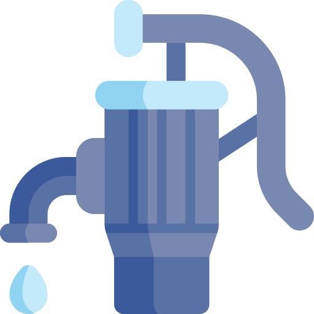

# Introduction
- This project is aimed for helping farmers take care of their crops, plants more effectively by providing basic dashboard with basic sensor values relating to Soil, Air, Water so that they can easily get to know the status of the environment.
- From Those values, the farmers can control, mix nutrients, irrigate their crops just by a click or even using our micro to control everything by speech.
- All the information is saved in blockchain so we can quality the correctness of the history => help farmers know what to improve if their crops have'nt grown well enough (you can download raw values from blockchain by an export button as well)
- Also provide a form allows user to init, add their crops to keep track of them, this crops information is also saved in our blockchain.
- As you may know, puting data in blockchain could be a little bit costing :D So I also create a market component which allows users to exchange crypto currencies here and the algorithm behind adding sensors, controllers to blockchain also be minimized by me.

# Component
- Dashboard 
- Form
- Display
- Market
- History

# How to use
## Requirements: 
Installing metamask extension in your browser is a must to Fully use all of the components in our app.
## How to run:
npm Install

npm run dev

# Demo

# About
Currently, two official plugins are available:

- [@vitejs/plugin-react](https://github.com/vitejs/vite-plugin-react/blob/main/packages/plugin-react/README.md) uses [Babel](https://babeljs.io/) for Fast Refresh
- [@vitejs/plugin-react-swc](https://github.com/vitejs/vite-plugin-react-swc) uses [SWC](https://swc.rs/) for Fast Refresh
